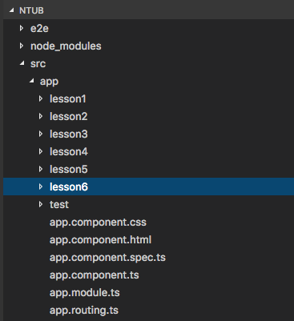

# AngularJS

*NTUB class*

* [AngularJS](https://zh.wikipedia.org/wiki/AngularJS)
* [雙向綁定](https://read01.com/nm2n8m.html)
* [TypeScript](https://zh.wikipedia.org/zh-tw/TypeScript)
* [ES6](http://www.ithome.com.tw/news/99160)

> jquery練習網站

[jsbin](https://jsbin.com/qoyugubeke/edit?html,console,output)

* Add library -> jquery-3.1.0.js

JQuery版雙向綁定

```javascript
<!DOCTYPE html>
<html>
<head>
  <meta charset="utf-8">
  <meta name="viewport" content="width=device-width">
<script src="https://code.jquery.com/jquery-3.1.0.js"></script>
  <title>JS Bin</title>
  <script>
    $(()=> {
      console.log("JQ Start");
      $("#tw").keyup(()=>{
        console.log("keyup");
        var twd = $("#tw").val()
        $("#us").text(twd * 30);
        $("#js").text(twd / 2);
    })
     })
  </script>
</head>
<body>
  <input type="text" id="tw">
  <div id="us">123</div>
  <div id="js">123</div>

</body>
</html>

// 冗長的程式碼～～ Angular不需要這樣！
```

> 安裝編輯工具

* [Visual Studio code](https://code.visualstudio.com/)

    1.*[美化介面](https://marketplace.visualstudio.com/items?itemName=robertohuertasm.vscode-icons)*

    2.*[Angular v2 TypeScript Snippets](https://marketplace.visualstudio.com/items?itemName=johnpapa.Angular2)*

    3.*[Auto Import](https://marketplace.visualstudio.com/items?itemName=steoates.autoimport)*

* [Atom](https://atom.io/)

  1.*emmet*

  2.*Angular-2 TypeScript Snippets*

  3.*Angularjs*

  4.*Atom Beautify*

> 安裝Node.js 7.7.4

* https://nodejs.org/en/

> 安裝angular commend line

 ```bash
 $ npm instal npm install -g @angular/cli
 ```

> 新建angular專案

```bash
$ ng new <"Project name">
```

> 啟動服務

```bash
$ ng serve
```

## angular 說明

---------------------------------

> 主要程式碼路徑

ProjectName/src/app



> 相關component匯入


> 刪除component

1. 刪除component的資料夾

2. 刪除app.module.ts裡面的import的component

3. 刪除app.module.ts裡面的@NgModule的component

-----------------------
> 新建組建（功能）：

```bash
ng generate component <"component name">

or

ng g c <"component name">
```

> 單向綁定

預設頁面導至自建component頁面

src/app/app.component.html

```html
<app-test></app-test>
```

src/app/test/test.component.ts

```js
import { Component, OnInit } from '@angular/core';

@Component({
  selector: 'app-test',
  templateUrl: './test.component.html',
  styleUrls: ['./test.component.css']
})
export class TestComponent implements OnInit {
  tw: number = 100 <!--我新增的變數-->

  constructor() { }

  ngOnInit() {
  }


  hello() {
    alert("Hello World!");
  }

}
```

src/app/test/test.component.ts

```js
<!--單向綁定-->

<input type="text" [value]="tw">
<p>
  {{tw}}
</p>
```

> 雙向綁定

commend line add ```ng g c lesson1```

src/app/app.component.html

```html
<app-lesson1></app-lesson1>
```

src/app/test/lesson1.component.ts

```js
import { Component, OnInit } from '@angular/core';

@Component({
  selector: 'app-lesson1',
  templateUrl: './lesson1.component.html',
  styleUrls: ['./lesson1.component.css']
})
export class Lesson1Component implements OnInit {
  money: number = 0
  constructor() { }

  ngOnInit() {
  }

}
}
```

src/app/test/lesson1.component.ts

```js
<div>
  <!--雙向綁定-->
  tw$ <input type="text" [(ngModel)]="money" >
  <p>us$ {{money*30}}</p>
  <p>jp$ {{money*0.2}}</p>
</div>
```

> typescript to javascript

```bash
$ ng build
```

> 假server

只安裝在專案資料夾下

```bash
$ npm install live-server
```

全域安裝

```bash
$ npm install live-server -g
```

使用

```
$ live-server
```

> Angular2檔案儲存瘦身

1. 刪除node_modules資料夾

2. 使用時cd到專案目錄下``npm install``，會透過package.js把node_modules裡的套件下載回來

> 建置成可以部署的網站

1. cd到專案目錄``ng build –prod``

2. 完成後會產生``dist``資料夾


* cd到``dist``,執行``live-server``才能瀏覽網站
