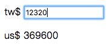

# Lesson1

課堂練習1
## 匯率轉換



### 1. Add new component

```bash
$ ng g c lesson1
```

### 2. Edit app.component.html

> 透過app.component.html(root/index)插入lesson1.component.html頁面

ProjectName/src/app/app.component.html

```js
<app-lesson1></app-lesson1>
```

### 3. Edit lesson1.component.ts

>   在component的TypeScript檔裡加入變數``money``，型態number

ProjectName/src/app/lesson1/lesson1.component.ts

```js
import { Component, OnInit } from '@angular/core';

@Component({
  selector: 'app-lesson1',
  templateUrl: './lesson1.component.html',
  styleUrls: ['./lesson1.component.css']
})
export class Lesson1Component implements OnInit {

  money: number = 0
  constructor() { }

  ngOnInit() {
  }

}

```

### 4. Edit lesson1.component.html

> 使用雙向綁定

ProjectName/src/app/lesson1/lesson1.component.html

```js
<p>
  lesson1 works!
</p>
<div>

  tw$ <input type="text" [(ngModel)]="money" >
  <p>us$ {{money*30}}</p>
  <p>jp$ {{money*0.2}}</p>
</div>
```

### 5. Building

```bash
$ ng build
```

### 6. Run

```bash
$ ng serve
```
### 7. open Chrome

>  輸入http://localhost:4200/

> localhost == 127.0.0.1 == 本機

-----------------------------

> 如果頁面上停在Loading代表有錯誤

> Chrome-->更多工具-->開發人員工具==>Console, 查看錯誤訊息
