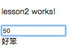
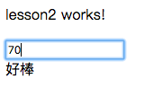

# Lesson2

課堂練習2
## 判斷成績是否大於60並顯示好棒跟好笨




### 1. Add new component

```bash
$ ng g c lesson2
```

### 2. Edit app.component.html

> 透過app.component.html(root/index)插入lesson2.component.html頁面

ProjectName/src/app/app.component.html

```js
<app-lesson2></app-lesson2>
```

### 3. Edit lesson2.component.html

> 使用ngIf

ProjectName/src/app/lesson2/lesson2.component.html

```js
<p>
  lesson2 works!
</p>
<input type="text" [(ngModel)]="score">
<div *ngIf="score>=60">好棒</div>
<div *ngIf="score<60">好笨</div>
```

### 4. Building

```bash
$ ng build
```

### 5. Run

```bash
$ ng serve
```
### 6. open Chrome

>  輸入http://localhost:4200/

> localhost == 127.0.0.1 == 本機

-----------------------------

> 如果頁面上停在Loading代表有錯誤

> Chrome-->更多工具-->開發人員工具==>Console, 查看錯誤訊息
