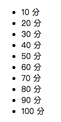

# Lesson3

課堂練習3



### 1. Add new component

```bash
$ ng g c lesson3
```

### 2. Edit app.component.html

> 透過app.component.html(root/index)插入lesson3.component.html頁面

ProjectName/src/app/app.component.html

```js
<app-lesson3></app-lesson3>
```

### 3. Edit lesson3.component.ts

>   在component的TypeScript檔裡加入陣列``ary``，型態number

ProjectName/src/app/lesson3/lesson3.component.ts

```js
import { Component, OnInit } from '@angular/core';

@Component({
  selector: 'app-lesson3',
  templateUrl: './lesson3.component.html',
  styleUrls: ['./lesson3.component.css']
})
export class Lesson3Component implements OnInit {

  ary:number[] = [10,20,30,40,50,60,70,80,90,100]
  constructor() { }

  ngOnInit() {
  }

}

```

### 4. Edit lesson3.component.html

> 使用ngFor迭代

ProjectName/src/app/lesson3/lesson3.component.html

```js
<ul><li *ngFor="let item of ary" >{{item}} 分</li></ul>
```

### 5. Building

```bash
$ ng build
```

### 6. Run

```bash
$ ng serve
```
### 7. open Chrome

>  輸入http://localhost:4200/

> localhost == 127.0.0.1 == 本機

-----------------------------

> 如果頁面上停在Loading代表有錯誤

> Chrome-->更多工具-->開發人員工具==>Console, 查看錯誤訊息
