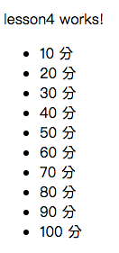

# Lesson1

課堂練習4
## Child Component



### 1. Add new component

```bash
$ ng g c lesson4
```

### 2. Edit app.component.html

> 透過app.component.html(root/index)插入lesson4.component.html頁面

ProjectName/src/app/app.component.html

```js
<app-lesson4></app-lesson4>
```

### 3. Edit lesson4.component.html

ProjectName/src/app/lesson4/lesson4.component.html

```js
<app-lesson4><app-lesson3></app-lesson3></app-lesson4>
```

### 4. Building

```bash
$ ng build
```

### 5. Run

```bash
$ ng serve
```
### 6. open Chrome

>  輸入http://localhost:4200/

> localhost == 127.0.0.1 == 本機

-----------------------------

> 如果頁面上停在Loading代表有錯誤

> Chrome-->更多工具-->開發人員工具==>Console, 查看錯誤訊息
