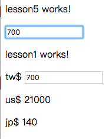

# Lesson5

課堂練習5
## @Input



### 1. Add new component

```bash
$ ng g c lesson5
```

### 2. Edit app.component.html

> 透過app.component.html(root/index)插入lesson5.component.html頁面

ProjectName/src/app/app.component.html

```js
<app-lesson5></app-lesson5>
```

### 3. Edit lesson5.component.ts

>   在component的TypeScript檔裡加入變數``tw``，型態number

ProjectName/src/app/lesson5/lesson5.component.ts

```js
import { Component, OnInit } from '@angular/core';

@Component({
  selector: 'app-lesson5',
  templateUrl: './lesson5.component.html',
  styleUrls: ['./lesson5.component.css']
})
export class Lesson5Component implements OnInit {
  tw:number = 0
  constructor() { }

  ngOnInit() {
  }

}

```

### 4. Edit lesson5.component.html

ProjectName/src/app/lesson5/lesson5.component.html

```js
<p>
  lesson5 works!
</p>
<input type="text" [(ngModel)]="tw">
<app-lesson1 [tw]="tw"></app-lesson1>
```

### 5. Edit lesson1.component.ts

>   import Input,變數前面加@Input('參數')

ProjectName/src/app/lesson1/lesson1.component.ts

```js
import { Component, OnInit, Input, EventEmitter } from '@angular/core';

@Component({
  selector: 'app-lesson1',
  templateUrl: './lesson1.component.html',
  styleUrls: ['./lesson1.component.css']
})
export class Lesson1Component implements OnInit {
  // @Input()money: number = 0
  @Input('tw')money: number = 0

  constructor() { }

  ngOnInit() {
  }

}

```

### 6. Building

```bash
$ ng build
```

### 7. Run

```bash
$ ng serve
```
### 8. open Chrome

>  輸入http://localhost:4200/

> localhost == 127.0.0.1 == 本機

-----------------------------

> 如果頁面上停在Loading代表有錯誤

> Chrome-->更多工具-->開發人員工具==>Console, 查看錯誤訊息
