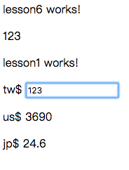

# Lesson5

課堂練習
## @Output



### 1. Add new component

```bash
$ ng g c lesson6
```

### 2. Edit app.component.html

> 透過app.component.html(root/index)插入lesson6.component.html頁面

ProjectName/src/app/app.component.html

```js
<app-lesson6></app-lesson6>
```

### 3. Edit lesson6.component.html

ProjectName/src/app/lesson6/lesson6.component.html

```js
<p>
  lesson6 works!
</p>
<div>{{num}}</div>
<app-lesson1 (countChange)="num = $event" ></app-lesson1>
```

### 4. Edit Lesson1Component.component.html

ProjectName/src/app/lesson1/lesson1.component.html

```js
<p>
  lesson1 works!
</p>
<div>

  tw$ <input type="text" [(ngModel)]="money" (ngModelChange)="putNum()">
  <p>us$ {{money*30}}</p>
  <p>jp$ {{money*0.2}}</p>
</div>
```

### 5. Edit lesson1.component.ts

>   import Output,宣告變數``countChange``前面加@Output(),型態
>   EventEmitter<(發射出去的變數型態)> ~>Ｏutput發射器

ProjectName/src/app/lesson1/lesson1.component.ts

```js
import { Component, OnInit, Input, Output, EventEmitter } from '@angular/core';

@Component({
  selector: 'app-lesson1',
  templateUrl: './lesson1.component.html',
  styleUrls: ['./lesson1.component.css']
})
export class Lesson1Component implements OnInit {
  // @Input()money: number = 0
  @Input('tw')money: number = 0
  @Output() countChange:EventEmitter<number> = new EventEmitter<number> ()
  constructor() { }

  ngOnInit() {
  }

  putNum(){
    this.countChange.emit(this.money)
  }
}

```

### 6. Building

```bash
$ ng build
```

### 7. Run

```bash
$ ng serve
```
### 8. open Chrome

>  輸入http://localhost:4200/

> localhost == 127.0.0.1 == 本機

-----------------------------

> 如果頁面上停在Loading代表有錯誤

> Chrome-->更多工具-->開發人員工具==>Console, 查看錯誤訊息
