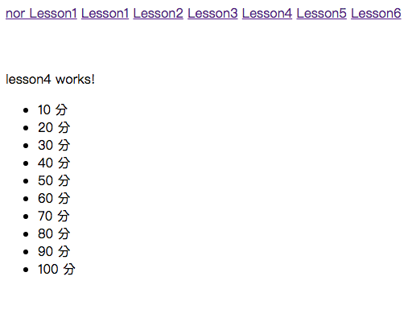

# AngularJS Routing

### 1. Create a new file

> 建立一個新檔案``app.routing.ts``在``ProjectName/src/app/``底下

### 2. Edit file

> import router

```js
1 import {ModuleWithProviders} from '@angular/core'
2 import { Routes, RouterModule } from '@angular/router'
```

> import Component

```js
import { Lesson1Component } from "./lesson1/lesson1.component";
import { Lesson2Component } from "app/lesson2/lesson2.component";
import { Lesson3Component } from "app/lesson3/lesson3.component";
import { Lesson4Component } from "app/lesson4/lesson4.component";
import { Lesson5Component } from "app/lesson5/lesson5.component";
import { Lesson6Component } from "app/lesson6/lesson6.component";
```

> setting router

```js
export const router:Routes = [
    {path:'',redirectTo:'lesson1', pathMatch:'full'},
    {path:'lesson1',component:Lesson1Component},
    {path:'lesson2',component:Lesson2Component},
    {path:'lesson3',component:Lesson3Component},
    {path:'lesson4',component:Lesson4Component},
    {path:'lesson5',component:Lesson5Component},
    {path:'lesson6',component:Lesson6Component},
    // {path:'**',component:NotFound}
    // 什麼頁面都找不到時觸發
];
```

> setting home

```js
export const routes:ModuleWithProviders = RouterModule.forRoot(router);
```

>> ALL CODE ``app.routing.ts``

```js
import {ModuleWithProviders} from '@angular/core'
import { Routes, RouterModule } from '@angular/router'

import { Lesson1Component } from "./lesson1/lesson1.component";
import { Lesson2Component } from "app/lesson2/lesson2.component";
import { Lesson3Component } from "app/lesson3/lesson3.component";
import { Lesson4Component } from "app/lesson4/lesson4.component";
import { Lesson5Component } from "app/lesson5/lesson5.component";
import { Lesson6Component } from "app/lesson6/lesson6.component";

export const router:Routes = [
    {path:'',redirectTo:'lesson1', pathMatch:'full'},
    {path:'lesson1',component:Lesson1Component},
    {path:'lesson2',component:Lesson2Component},
    {path:'lesson3',component:Lesson3Component},
    {path:'lesson4',component:Lesson4Component},
    {path:'lesson5',component:Lesson5Component},
    {path:'lesson6',component:Lesson6Component},
    // {path:'**',component:NotFound}
    // 什麼頁面都找不到時觸發
];

export const routes:ModuleWithProviders = RouterModule.forRoot(router);
```

### 3. Edit ``app.component.html``

ProjectName/src/app/app.component.html

```js
<a href="/lesson1">nor Lesson1</a>
<a [routerLink]="['/lesson1']" >Lesson1</a>
<a [routerLink]="['/lesson2']" >Lesson2</a>
<a [routerLink]="['/lesson3']" >Lesson3</a>
<a [routerLink]="['/lesson4']" >Lesson4</a>
<a [routerLink]="['/lesson5']" >Lesson5</a>
<a [routerLink]="['/lesson6']" >Lesson6</a>

<br>
<br>
<br>

<router-outlet></router-outlet>
```

### 4. Edit app.module.ts

ProjectName/src/app/app.module.ts

```js
import { BrowserModule } from '@angular/platform-browser';
import { NgModule } from '@angular/core';
import { FormsModule } from '@angular/forms';
import { HttpModule } from '@angular/http';

import { AppComponent } from './app.component';
import { TestComponent } from './test/test.component';
import { Lesson1Component } from './lesson1/lesson1.component';
import { Lesson2Component } from './lesson2/lesson2.component';
import { Lesson3Component } from './lesson3/lesson3.component';
import { Lesson4Component } from './lesson4/lesson4.component';
import { Lesson5Component } from './lesson5/lesson5.component';
import { Lesson6Component } from './lesson6/lesson6.component';
import {routes} from './app.routing';   ///加上這行

@NgModule({
  declarations: [
    AppComponent,
    TestComponent,
    Lesson1Component,
    Lesson2Component,
    Lesson3Component,
    Lesson4Component,
    Lesson5Component,
    Lesson6Component
  ],
  imports: [
    BrowserModule,
    FormsModule,
    HttpModule,
    routes    // 加上這行
  ],
  providers: [],
  bootstrap: [AppComponent]
})
export class AppModule { }
```

### 5. Building

```bash
$ ng build
```

### 6. Run

```bash
$ ng serve
```
### 7. open Chrome

>  輸入http://localhost:4200/

> localhost == 127.0.0.1 == 本機

-----------------------------

> 如果頁面上停在Loading代表有錯誤

> Chrome-->更多工具-->開發人員工具==>Console, 查看錯誤訊息

---------------------------



